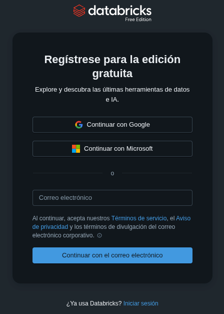
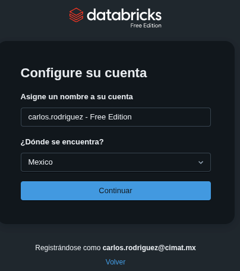
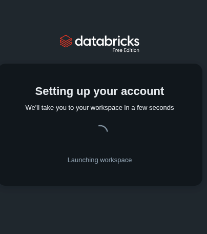

# How to Create an account in Databricks Free Edition

Databricks Free Edition is a Free Platform where you can store, process, share and analyze data. It has several usefull features such as job orquestration, streaming capabilities, model deployment, model monitoring, etc.

The following steps will guide you to sign up to the platform

<ol>
<li> Enter to the official site <a href= "https://www.databricks.com/learn/free-edition">https://www.databricks.com/learn/free-edition</a> and click on "Sign up for Free Edition"  
</img> </li>
<li> Use a valid email and press continue   </img>  </li>
<li> Select a name for your Workspace   </img>  </li>
<li> Wait until your workspace is created   </img>  </li>
</ol>

If you're having issues try looking into the official guide
* Here is the official guide to <a href = "https://docs.databricks.com/aws/en/getting-started/free-edition">Sign Up</a>
