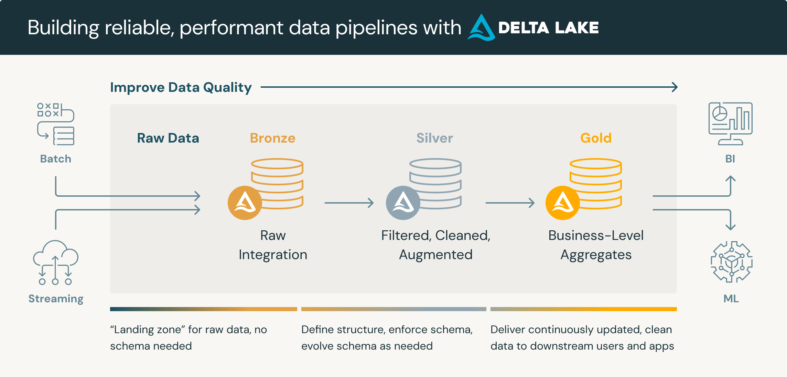

# Medallion Architecture

A <a href ="https://www.databricks.com/es/blog/what-is-medallion-architecture">Medallion_Architecture</a> is a data design pattern used to logically organize data in a lakehouse, with the goal of incrementally and progressively improving the structure and quality of data as it flows through each layer of the architecture (from Bronze ⇒ Silver ⇒ Gold layer tables). Medallion architectures are sometimes also referred to as "multi-hop" architectures.

In simple words, it's one common way to organize data, mostly tables in a logical order. The stages follows the data preparation process, as bronze is commonly refered to the layer where raw data is stored and gold layer where the ready to use data lives.

</i>

