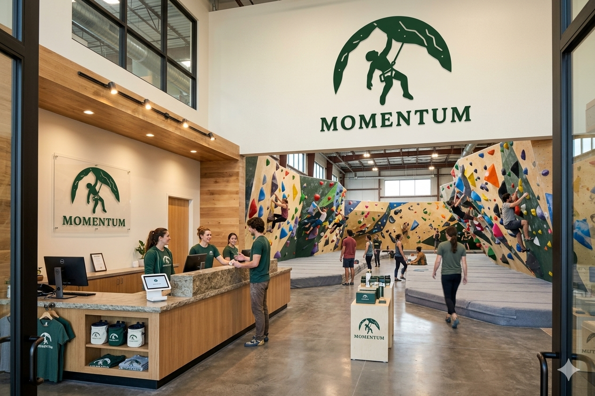

# Momentum Boulering Gym

## Table of Contents

- [What is momentum](#whatis)
- [About the logo](#logo)
- [About the values](#values)

## What is momentum 

Momentum is a bouldering gym located in Guanajuato.  
</img> 

## About the logo
The logo reflects our life thinking that reduces to "Even in the hardest moments keep trying".
As you can see, the climber is holding tight with just one hand to a very stiff cliff, most people would've given up... but he's still hanging as if his life depends upon that hold. 
We see life this way, success is just a small crimp which you have to hold no matter what!
</img> 

## About the values 

We welcome everyone to have fun and train inside Momentum. Momentum also shares this values

- <b>Friendship</b>: We want everyone to get a taste of the climbing brotherhood
- <b>Sportmanship</b>: Lets treat all members with respect, we all started from zero
- <b>Passion</b>: Every boulder problem requires all you've got, how can you achieve complex goals without passion?
- <b>Perseverance</b>: Don't give up! You're going to make it!

And don't forget rule number 1... have fun!

[!NOTE]  
Momentum doesn't exists, all information and data are made up for the Demo

Proyect on development...
