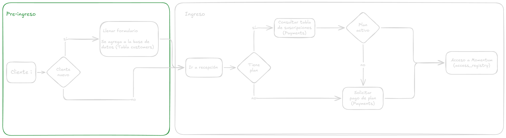
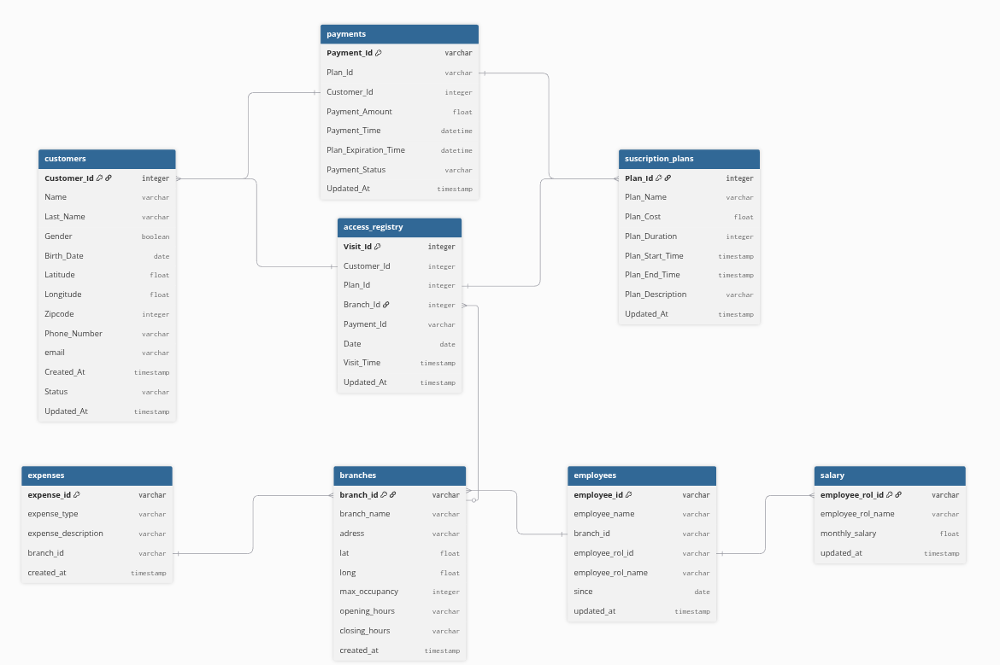

# Momentum & Data

# Momentum Access Flow and data gathering

To access the gym, a few steps are required. The next figure shows the flow

</img> 

<ol>
<li> Every new member, will need to fill a form and explicitly agree to the Liability Waiver. All data collected is appended to "customers".
</li>
<li> Every customer must go to the reception area, they can scan a code if they have paid a plan before or pay for any available plan.
</li>
<li> In case a code is not working or the plan suscription has ended, then staff will help you either giving you manual access or requesting payment for a new plan, append the information to "payments" .
</li>
<li> Once payment is validated the access information is appended to "access_registry", your climbing journey begins!
</li>
</ol>

# Momentum tables

Momentum opened aproximately 5 months ago, so let's consider it a quite new bussines. Being new also means having to build some stuff from scratch, such as designing a data model or choosing the right tools. After some discussion, the E-R model contains 8 tables that will preserve all the data we need (at the moment!)

</img> 