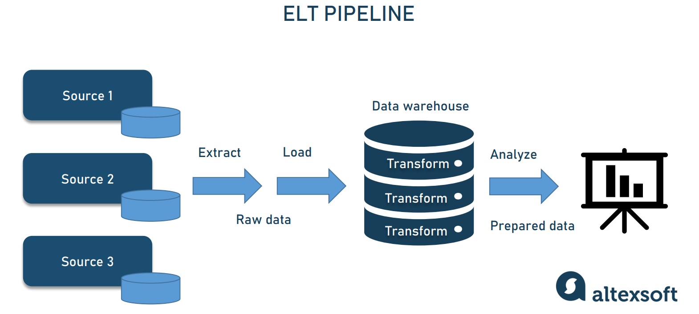

# Workshop Agenda (Part I)

## Table of Contents

- [Introduction](#objectives)
    - [Data Engineering Overview](#data_eng)
    - [Momentum Proyect](#momentum)
    - [Databricks Walkthrough](#db_tour)
        - [Databricks Main Features](#workspace-setup)
        - [Databricks Connectors](#workspace-setup)
        - [Databricks Unity Catalog](#UC)
- [Databricks Hands On](#hands_on)
    - [Create Catalogs](#UC) 
    - [Uploading Data](#upload)
    - [Creating a Table](#first_table)
    - [Querying](#sql_editor)
    - [Updating a Table](#db_tour)
    - [Transforming Data](#db_tour)

## Data Engineering Overview 

The discipline of designing, building, and maintaining robust data pipelines that collect, transform, and deliver clean data to analytics and AI at scale. <a href ="https://www.databricks.com/es/blog/what-is-data-engineering">what_is_data_engineering</a>

	</img> 

## Momentum Proyect 

Momentum is a bouldering gym located in Guanajuato. See more,  <a href= './Momentum.md'>Momentun</a>

<u><b><i>Momentum & Data</i></b></u>

As customers increase, data and complexity increase too, leading to problems that are not as easily solved as expected. 
In this scenario, some questions arise

- How many customers are we receiving per day? Is there any trend?
- Should I hire more staff certain days?
- What is the gross income?
- Do the suscription plans prices makes sense?
- Where are my customers located? Are my customers students, kids, workers?

<b><i><u>Our mission</u></i></b>

In order to help Momentum, we have to gather all data and upload it in Databricks. For this we'll need to

<ol>
<li> Extract the different files, tables or objects from available sources </li>
<li> Create catalogs and schemas in Unity Catalog (UC) </li>
<li> Upload or create tables in bronze layer (Multihop architecture) </li>
<li> Manage the tables or objects using UC </li>
<li> Create cleaned or enriched tables in silver layer</li>
<li> Prepare production tables for Data scientist or Data analyst</li>
</ol>

